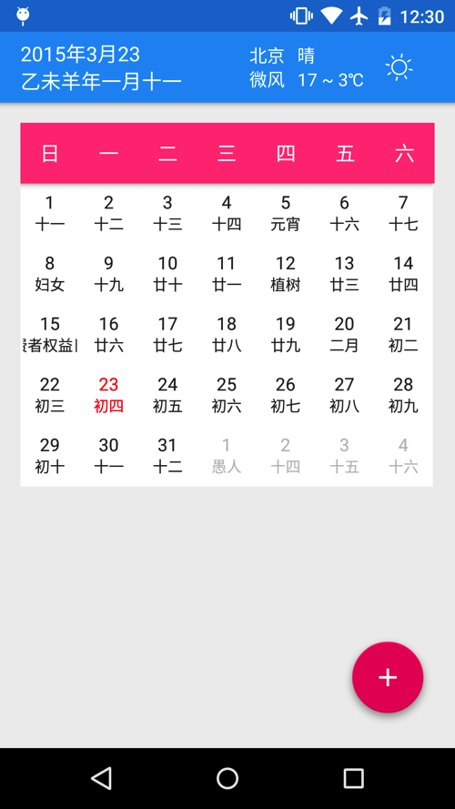

# MaterialCalendar
这是一个开源的日历代码,采取MaterialDesign的风格来设计,一方面是为了练手,另一方面希望在开发过程中能整理出来几个有用库,农历的算法节气之类的要是计算的的话比较头疼,下一个版本尽量解决.下面列出已完成部分还有正在开发的部分,有好的建议欢迎提出issue

# Project

version 1.0

* 天气的动画图标
* 天气信息的获取
* 日历的生成
* 农历的计算
* 禁忌的展示

# Feature

version 1.1

* 节日的补充
* 备忘的添加
* 性能的优化
* 天气的城市选择

# Thanks

* [butterknife](https://github.com/JakeWharton/butterknife)
* [SuperToasts](https://github.com/JohnPersano/SuperToasts)
* [lichao315](https://github.com/lichao315/Calendar)
* [CircularReveal](https://github.com/ozodrukh/CircularReveal)
* [ArcAnimator](https://github.com/asyl/ArcAnimator)
* [NineOldAndroids](https://github.com/JakeWharton/NineOldAndroids/)
* [Skycons](https://github.com/torryharris/Skycons)

## License

    Copyright 2011-2015 Haoxiqiang

    Licensed under the Apache License, Version 2.0 (the "License");
    you may not use this file except in compliance with the License.
    You may obtain a copy of the License at

       http://www.apache.org/licenses/LICENSE-2.0

    Unless required by applicable law or agreed to in writing, software
    distributed under the License is distributed on an "AS IS" BASIS,
    WITHOUT WARRANTIES OR CONDITIONS OF ANY KIND, either express or implied.
    See the License for the specific language governing permissions and
    limitations under the License.